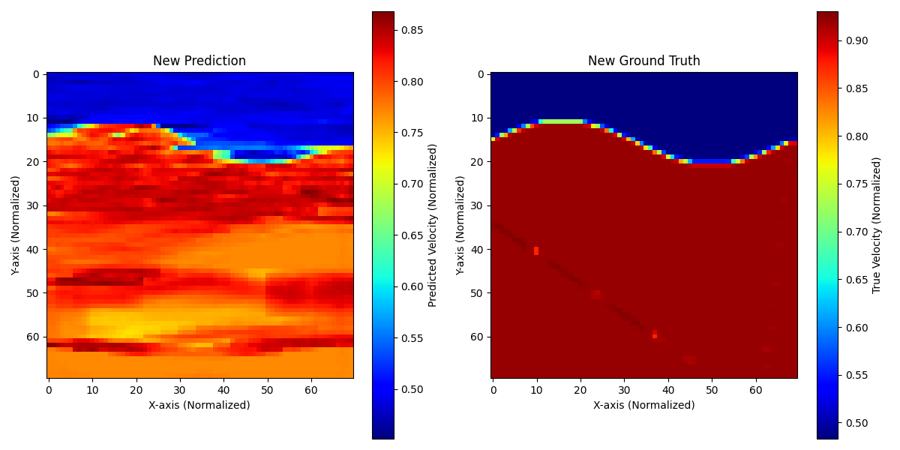

# GeoNet-Inversion

Geophysical Waveform Inversion using UNet.

## Project Structure

- `config.py`: Centralized hyperparameters and paths.
- `dataset.py`: Data loading and normalization.
- `model.py`: UNet architecture and loss functions (SSIM, Gradient).
- `utils.py`: Plotting and physical metric calculations (MAE, RMSE, Edge Error).
- `train.py`: Training pipeline using `uNet`.
- `evaluate.py`: Evaluation and sanity check tool using `uNet`.

## Usage

### Training
To train the model:
```bash
python train.py
```

### Evaluation
To evaluate the trained model:
```bash
python evaluate.py
```

### Sanity Check (Untrained Model)
To verify the output structure with an untrained model:
```bash
python evaluate.py --untrained
```
## 📊 Training Logs & Version History

| Version | Architecture | Params | Key Features / Changes | Final Loss | SSIM |
| :--- | :--- | :--- | :--- | :--- | :--- |
| **v1** | Baseline U-Net | ~467k | Initial proof-of-concept, single file | 5.835 | N/A |

---

### 🟢 Version 1: Baseline U-Net
* **Status**: Completed
* **Environment**: Google Colab (T4 GPU)
* **Architecture**: Standard U-Net with skip connections (~467,105 parameters)
* **Data Configuration**: 
  * Inputs: 5 sources, 1000 time samples, 70 receivers.
  * Targets: 70x70 single-channel velocity maps.
  * Scope: Single `.npy` file proof-of-concept.

**⚙️ Training Parameters**
* **Optimizer**: Adam (`lr=0.001`)
* **Batch Size**: 1
* **Epochs**: 200
* **Loss Function**: `100 * (MAE + 0.1 * MSE + 0.5 * Gradient Loss)`

**📈 Results & Observations**
* **Quantitative**: Final Training Loss hit `5.8353`.
* **Qualitative**: Achieved high-fidelity recovery of the macro-velocity structures. The model perfectly located the boundary between the two layers and identified the correct global velocity trends. Minor horizontal striation artifacts and slight edge blurring were present.



* **Key Takeaway**: The baseline proves the effectiveness of structural losses (gradient loss) in geophysical inversion tasks.

**📂 Artifacts**
* Weights: `results/v1/uNet_v1.pth`
* Visualization: `results/v1/pred_vs_GT_v1.png`
* Metrics Plot: `results/v1/epochs_vs_loss_v1.png`

**➡️ Next Steps for v2**: Scale up model capacity (double channel counts), implement SSIM loss to reduce horizontal artifacts, and move to a multi-file custom PyTorch Dataset.


---

