# GeoNet-Inversion

Turning seismic wave signals into detailed underground maps with deep neural networks.


## Project Structure

- `config.py`: Centralized hyperparameters and paths.
- `dataset.py`: Data loading and normalization.
- `model.py`: UNet architecture and loss functions (SSIM, Gradient).
- `utils.py`: Plotting and physical metric calculations (MAE, RMSE, Edge Error).
- `train.py`: Training pipeline .
- `evaluate.py`: Evaluation and visualization .

## Usage

### Training
To train the model:
```bash
python train.py
```

### Evaluation
To evaluate the trained model:
```bash
python evaluate.py
```

## 📊 Training Logs & Version History

| Version | Architecture | Params | Key Features / Changes | Final Loss | SSIM |
| :--- | :--- | :--- | :--- | :--- | :--- |
| **v1** | Baseline U-Net | ~467k | Initial proof-of-concept, single file | 5.835 | N/A |
| **v2** | Scaled U-Net | ~1.93M | Increased channel counts, Cosine Decay with LR Scheduling | 0.8082 | 0.9910 |
| **v2.5** | Scaled U-Net + BN | ~7.8M | Multi-family training (14 files), TV loss, AMP, file-level split | 9.60 (train) | 0.81 (val) |
| **v3** | Swin-UNet | ~12M | Swin Transformer, DropPath (0.2), Sample-level split, Mode Collapse | 11.88 (train) / 12.21 (val) | 0.8442 (test) |
| **v4** | Hybrid CNN-Swin + PINN | ~17.1M | Physics-Informed loss (Deepwave), CNN encoder/decoder, Swin bottleneck | 11.52 (train) / 11.73 (val) | 0.8500 (test) |
| **v5** | Deep CNN Encoder-Decoder | ~27.6M | Pure CNN (no transformers), wide bottleneck, removed physics loss | ~10.2 (train) / ~13.0 (val) | 0.8201 (test) |

---

### 🟢 Version 1: Baseline U-Net
* **Status**: Completed
* **Environment**: Google Colab (T4 GPU)
* **Architecture**: Standard U-Net with skip connections (~467,105 parameters)
* **Data Configuration**: 
  * Inputs: 5 sources, 1000 time samples, 70 receivers.
  * Targets: 70x70 single-channel velocity maps.
  * Scope: Single `.npy` file proof-of-concept.

**⚙️ Training Parameters**
* **Optimizer**: Adam (`lr=0.001`)
* **Batch Size**: 1
* **Epochs**: 200
* **Loss Function**: `100 * (MAE + 0.1 * MSE + 0.5 * Gradient Loss)`

**📈 Results & Observations**
* **Quantitative**: Final Training Loss: `5.8353`.
* **Qualitative**: Achieved high-fidelity recovery of the macro-velocity structures. The model perfectly located the boundary between the two layers and identified the correct global velocity trends. Minor horizontal striation artifacts and slight edge blurring were present.
* **Key Takeaway**: The baseline proves the effectiveness of structural losses (gradient loss) in geophysical inversion tasks.

**📂 Artifacts**
* Weights: `results/v1/uNet_v1.pth`
* Visualization: `results/v1/pred_vs_GT_v1.png`
* Metrics Plot: `results/v1/epochs_vs_loss_v1.png`

**➡️ Next Steps for v2**: Scale up model capacity (double channel counts), implement SSIM loss to reduce horizontal artifacts, and add LR schedule with cosine decay.

---

### 🟢 Version 2: Scaled U-Net
* **Status**: Completed
* **Environment**: Google Colab (T4 GPU)
* **Architecture**: Scaled U-Net with skip connections (~1.9M parameters)
* **Data Configuration**: 
  * Inputs: 5 sources, 1000 time samples, 70 receivers.
  * Targets: 70x70 single-channel velocity maps.
  * Scope: Single `.npy` file.

**🔁 Key Changes from v1**
* Increased channel capacity (16→32→64→128→256)
* Added SSIM loss
* Switched to AdamW
* Added Cosine LR decay
* Increased epochs (200 → 400)
* Increased batch size (1 → 2)

**⚙️ Training Configuration**
* **Optimizer**: AdamW (`lr=0.001`)
* **Scheduler**: Cosine Decay
* **Batch Size**: 2
* **Epochs**: 400
* **Loss Function**: `100 * (MAE + 0.1 * MSE + 0.2 * Gradient + 0.3 * SSIM)`

**📊 Quantitative Results**
* Final Loss: `0.8082`
* MAE: `18.26` m/s
* RMSE: `43.75`
* SSIM: `0.9910`
* Edge Error: `0.0042`

**🧠 Qualitative Analysis**
* Near-perfect reconstruction of subsurface structure with highly accurate boundary localization.
* Significant reduction in artifacts compared to v1.
* Minor issues include slight boundary thickness and low-frequency banding.

**🖼️ Sample Predictions**
<table> 
  <tr> 
    <td></td> 
    <td></td> 
  </tr> 
  <tr> 
    <td></td> 
    <td></td> 
  </tr> 
  <tr> 
    <td></td> 
    <td></td> 
  </tr> 
</table>

**📈 Training Behavior**
* Smooth convergence with no instability.
* Late-stage improvement due to cosine decay.
* No underfitting observed.

**🔑 Key Takeaways**
* Model scaling significantly improved reconstruction quality.
* SSIM loss is critical for structural alignment.
* LR scheduling improves convergence and final performance.
* Model captures both global and local geological features reliably.

**⚠️ Generalization Gap (Out-of-Distribution Testing)**
* V2 was trained on a **single file** from CurveFault-A (`seis2_1_0.npy`).
* Tested on an **unseen CurveFault-A file** (`seis4_1_0`): MAE `269.61` m/s, SSIM `0.7523`.
* Tested on **FlatVel-A** (different geology entirely): MAE `281.44` m/s, SSIM `0.7522`.
* Both unseen datasets scored nearly identically — confirming **single-file overfitting**, not architecture limitations.
* **Conclusion**: Data diversity (multi-file, multi-family training) is the primary bottleneck, not model capacity. This directly motivates V3's multi-dataset training strategy.

**📂 Artifacts**
* Weights: `results/v2/uNet_v2.pth`
* Metrics Plot: `results/v2/epochs_vs_loss_v2.png`
* LR Schedule: `results/v2/lr_vs_epochs_v2.png`

**➡️ Next Steps for v2.5**: Scale model capacity (4x channels), add BatchNorm + TV loss, train on multiple files across geological families, introduce val/test splits.

---

### 🟡 Version 2.5: Multi-Family Generalization Experiment
* **Status**: Completed (stopped early at epoch 81/300 — overfitting detected)
* **Environment**: Google Colab (T4 GPU), Mixed Precision (FP16)
* **Architecture**: Scaled U-Net with BatchNorm (~7,704,129 parameters)
* **Data Configuration**:
  * **Dataset**: OpenFWI — 6 geological families × 2 sub-variants × 2 files = 20 files (10,000 samples total)
  * Families: CurveFault, CurveVel, FlatFault, FlatVel, Style (A & B each)
  * **Split Strategy**: File-level (not sample-level)
    * Train: 14 files (7,000 samples, 70%)
    * Val: 3 files (1,500 samples, 15%)
    * Test: 3 files (1,500 samples, 15%)

**🔁 Key Changes from v2**
* 4× channel scaling (32→64→128→256 → **64→128→256→512**)
* Added **BatchNorm** after every conv layer (critical for multi-distribution stability)
* Added **Total Variation (TV) loss** (weight=0.1) for spatial smoothness
* Added **gradient clipping** (max_norm=1.0)
* **Mixed Precision (AMP)** training for T4 speedup
* **AdamW** with warmup (20 epochs) + cosine decay
* Validation loop with best-model saving + checkpointing every 50 epochs

**⚙️ Training Configuration**
* **Optimizer**: AdamW (`lr=0.0005`, `weight_decay=0.01`)
* **Scheduler**: Linear warmup (20 epochs) → Cosine Decay
* **Batch Size**: 16
* **Epochs**: 300 (stopped at 81)
* **Loss Function**: `100 * (MAE + 0.1 * MSE + 0.3 * Gradient + 0.3 * SSIM + 0.1 * TV)`

**📊 Training Logs**

| Epoch | Train Loss | Val Loss | Val SSIM | Status |
| :--- | :--- | :--- | :--- | :--- |
| 1 | 58.26 | 32.05 | 0.5855 | |
| 10 | 15.42 | 16.95 | 0.8107 | |
| 20 | 14.36 | 15.77 | **0.8177** | ← Peak Val SSIM |
| 30 | 13.31 | 15.42 | 0.8146 | |
| 40 | 12.43 | 15.32 | 0.8112 | |
| **50** | **11.61** | **15.16** | 0.8124 | ✅ **Best Checkpoint** |
| 60 | 10.86 | 16.47 | 0.7849 | ⚠️ Val rising |
| 70 | 10.13 | 15.65 | 0.7837 | ❌ Overfitting |
| 80 | 9.60 | 16.19 | 0.7694 | ❌ Stopped |

**🧠 Analysis: File-Level Overfitting**
* Train loss dropped steadily (58.3 → 9.6) but **val loss plateaued at ~15 and began rising after epoch 50**.
* Train-val gap widened from ~3.5 (epoch 30) to ~6.6 (epoch 80) — classic overfitting signature.
* Val SSIM peaked at **0.8177** (epoch 20) then degraded to **0.7694** (epoch 80).
* **Root Cause**: File-level splitting means the model never sees any samples from 6 held-out files (val + test). With 7.8M params on 7,000 samples, it memorizes per-file patterns rather than learning generalizable geology.

**🔑 Key Takeaways**
* BatchNorm + TV loss + AMP training pipeline works correctly — the infrastructure is solid.
* 7.8M params is sufficient capacity; the bottleneck is **data exposure**, not model size.
* File-level splitting is too strict for this dataset size — the model needs to see samples from ALL geological instances during training.
* Val SSIM of 0.81 on completely unseen files is actually a reasonable baseline, but not production-grade.

**📂 Artifacts**
* Best Model: `results/v2.5/uNet_v2.5.pth` (epoch 50)
* Checkpoint: `results/v2.5/checkpoint_epoch_50.pth`

**➡️ Next Steps for v3**
* Switch to **sample-level splitting** (random 70/15/15 across all 10,000 samples from all 20 files).
* Every geological family appears in train, val, AND test.
* Migrate to **Modal** for faster GPU access (A100/H100).
* If sample-level split succeeds (Val SSIM > 0.95), proceed to benchmark on Marmousi/BP 2004.
* Implement Swin-UNet : Replacing CNN with Vit in UNet architecture.

---

### 🟢 Version 3: Swin-UNet & Mode Collapse
* **Status**: Completed (300 Epochs)
* **Environment**: Modal A100-40GB
* **Architecture**: Swin-UNet with ~12M parameters (embed_dim=64, num_heads=(2, 4, 8, 16))
* **Data Configuration**:
  * **Dataset**: OpenFWI — 6 geological families × 2 sub-variants × 2 files = 20 files (10,000 samples total)
  * Families: CurveFault, CurveVel, FlatFault, FlatVel, Style (A & B each)
  * **Split Strategy**: Sample-level (randomly mixed)
    * Train: 7,000 samples (70%)
    * Val: 1,500 samples (15%)
    * Test: 1,500 samples (15%)

**🔁 Key Changes from v2.5**
* Replaced CNN with pure Vision Transformer **(Swin-UNet)** architecture.
* Implemented Shifted Window Self-Attention to capture long-range seismic dependencies.
* Switched to **Sample-level split** completely crossing all datasets.
* Custom Patch Embedding `(4, 2)` to natively handle highly rectangular data.
* Added **Stochastic Depth (DropPath)** with linear schedule (0% → 20%) to prevent co-adaptation.

**⚙️ Training Configuration**
* **Optimizer**: AdamW (`lr=0.0005`, `weight_decay=0.01`)
* **Scheduler**: Linear Warmup (30 epochs) → Cosine Annealing (270 epochs)
* **Batch Size**: 16
* **Epochs**: 300
* **Loss Function**: `100 * (1.0 * L1 + 0.1 * MSE + 0.3 * Gradient + 0.3 * SSIM + 0.1 * TV)`

**📊 Evaluation Results (Test Set - 1500 Samples)**
* Final Train Loss: `11.88`
* Final Val Loss: `12.21`
* Test MAE: `265.28` m/s
* Test RMSE: `365.68`
* Test SSIM: `0.8442`
* Test Edge Error: `0.0222`

**🖼️ Sample Predictions (Visualizing Mode Collapse)**
<table> 
  <tr> 
    <td>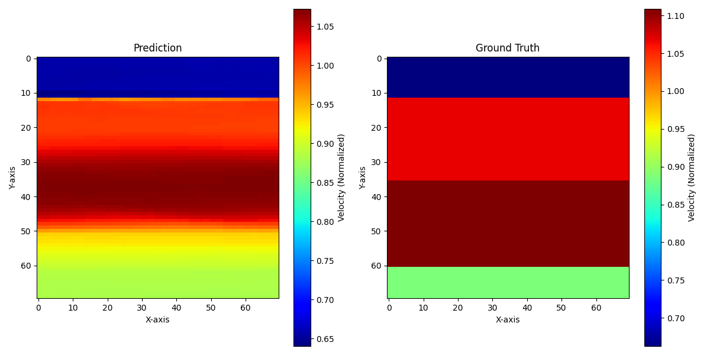</td> 
    <td>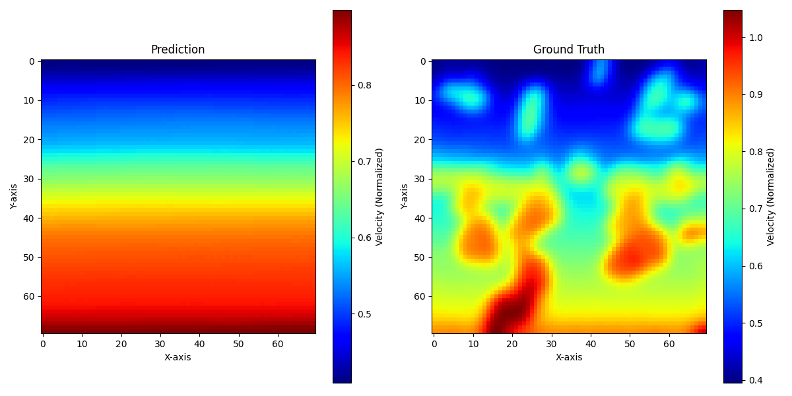</td> 
  </tr> 
  <tr> 
    <td>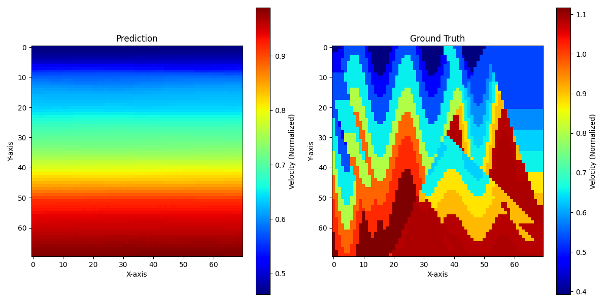</td> 
    <td>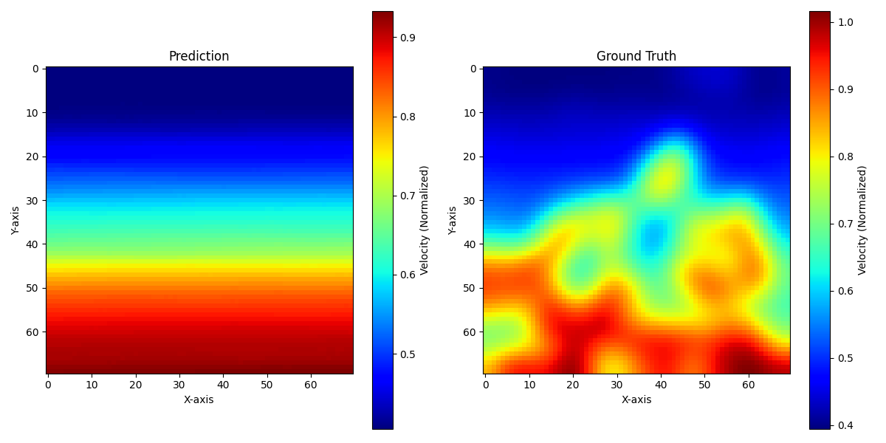</td> 
  </tr> 
  <tr> 
    <td>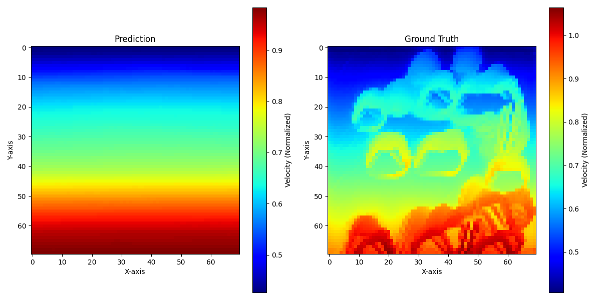</td> 
    <td>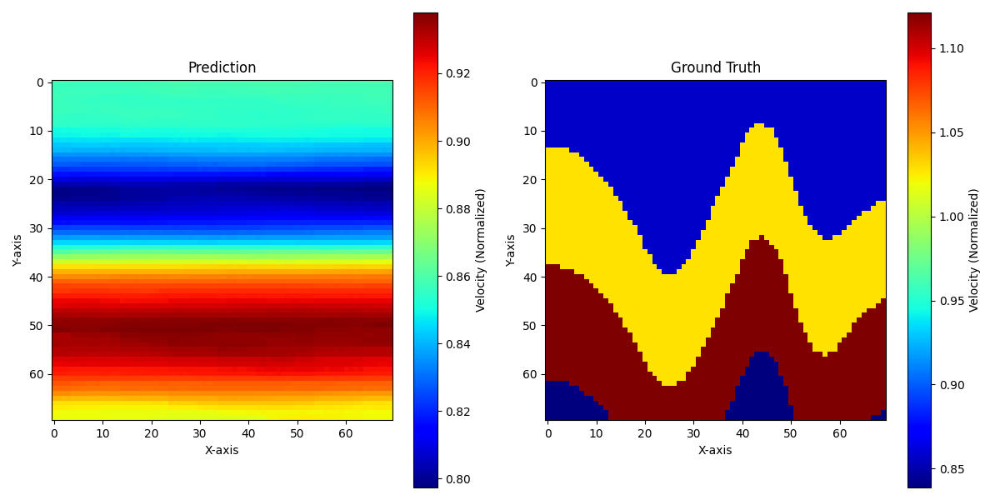</td> 
  </tr> 
</table>

**🧠 Analysis: Catastrophic Mode Collapse**
* The heavily requested DropPath successfully bridged the train/eval gap (Train `11.88` vs Val `12.21`). The model structurally avoided overfitting across the 10,000 samples.
* However, the network suffered from critical **Mode Collapse** on complex geometries.
* Instead of resolving sharp lateral faults, the model defaulted to generating a purely smooth, identically flat 1D depth profile (blue at surface to red at depth) for every file.
* The SSIM metric perfectly froze at `0.84` for 150 epochs because the 1D physical depth gradient naturally accounts for ~84% of the Earth's density structural variance, creating a deep mathematical "Safe Zone" local minimum.
* Over-regularization (0.1 TV Loss + 20% DropPath) violently penalized sharp features and risks, causing the math to retreat and favor generic vertical smoothing over all lateral anomaly resolution.

**🔑 Key Takeaways**
* Pure data-driven Vision Transformers with standard soft constraints (MSE, TV) hit a hard theoretical ceiling on heavily chaotic geology. They prioritize safe, blurry spatial averages over physically-accurate sharp fault demarcations.
* Architecture scaling and regularizations limit overfitting perfectly, but completely fail to teach acoustic wave propagation mechanics.

**📂 Artifacts**
* Weights: `results/v3/uNet_v3.pth`
* Validation PNGs: `results/v3/pred_vs_GT_*.png`
* Log History: `results/v3/eval_summary.txt`

**➡️ Next Steps for v4 (PINNs)**
* Phase 3 concludes the pure data-matching approach.
* Phase 4 must introduce **Physics-Informed Neural Networks (PINNs)**. 
* We must integrate the **Acoustic Wave Equation** as a hard physics constraint in the training loop. This will shatter the 1D "Safe Zone" by mathematically forcing the network to recognize that scattered echoes cannot physically originate from flat layers, thus forcing it to resolve sharp lateral faults natively.

---

### 🟡 Version 4: Physics-Informed Hybrid CNN-Swin (PINN)
* **Status**: Completed (89 Epochs — stopped early due to Modal preemption & credit limits)
* **Environment**: Modal A100-80GB
* **Architecture**: Hybrid CNN-Swin UNet with ~17.1M parameters
  * **Encoder**: ResConvBlocks (strong local feature extraction)
  * **Bottleneck**: Swin Transformer (384-dim, 8 heads — global geological reasoning)
  * **Decoder**: CNN upsampling (sharper reconstructions than transformer upsampling)
* **Data Configuration**:
  * **Dataset**: OpenFWI — 20 files (10,000 samples total)
  * **Split Strategy**: Sample-level (randomly mixed)
    * Train: 8,000 samples (80%)
    * Val: 1,000 samples (10%)
    * Test: 1,500 samples (15% — separate eval split)

**🔁 Key Changes from v3**
* Replaced pure Swin-UNet with **Hybrid CNN-Swin architecture** — CNN encoder/decoder for local inductive bias + Swin bottleneck for global context.
* Integrated **Deepwave** (differentiable acoustic wave propagator) for physics-informed training.
* Added `physics_loss()`: forward-models the predicted velocity through the scalar wave equation and compares synthetic seismic to actual input seismic.
* **Two-Phase Training Schedule**:
  * Phase A (Epochs 1–49): Pure data-driven loss (L1 + MSE + SSIM + Gradient + TV)
  * Phase B (Epochs 50+): Data loss + physics loss (weight ramped from 0.1 → 0.5)
* Reduced DropPath (0.2 → 0.1) and TV weight to prevent over-smoothing.
* Upgraded GPU from A100-40GB to A100-80GB.

**🌊 Physics Loss (Deepwave Integration)**
* OpenFWI Acquisition Geometry: `dx=10m`, `dt=0.001s`, Ricker wavelet at 15Hz
* 5 sources at verified positions `[0, 17, 34, 52, 69]`, 70 surface receivers
* Per-batch: de-normalizes predicted velocity → runs `deepwave.scalar()` forward modeling → compares synthetic vs observed seismic (amplitude-normalized MSE)

**⚙️ Training Configuration**
* **Optimizer**: AdamW (`lr=0.0005`, `weight_decay=0.01`)
* **Scheduler**: Linear Warmup (50 epochs) → Cosine Annealing (350 epochs)
* **Batch Size**: 16
* **Epochs**: 89 / 400 (preempted)
* **Loss Function**: `100 * (1.0 * L1 + 0.1 * MSE + 0.3 * Gradient + 0.3 * SSIM + 0.01 * TV) + physics_weight * physics_loss`

**📊 Evaluation Results (Test Set - 1500 Samples)**
* Final Train Loss: `11.52`
* Final Val Loss: `11.73`
* Test MAE: `251.18` m/s
* Test RMSE: `343.47`
* Test SSIM: `0.8500`
* Test Edge Error: `0.0227`

**📈 V3 → V4 Improvement**

| Metric | V3 | V4 | Change |
| :--- | :--- | :--- | :--- |
| Test MAE | 265.28 m/s | 251.18 m/s | **↓ 5.3%** |
| Test RMSE | 365.68 | 343.47 | **↓ 6.1%** |
| Test SSIM | 0.8442 | 0.8500 | **↑ 0.69%** |
| Edge Error | 0.0222 | 0.0227 | ↑ 2.3% |
| Parameters | 12M | 17.1M | +42% |

**🖼️ Sample Predictions**
<table> 
  <tr> 
    <td>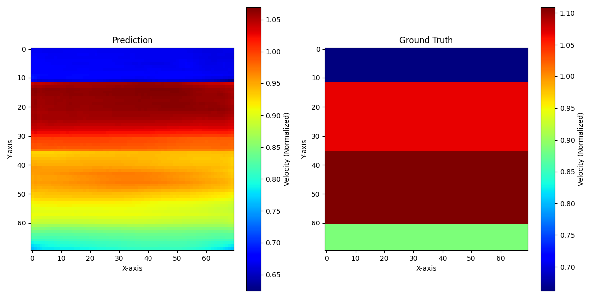</td> 
    <td>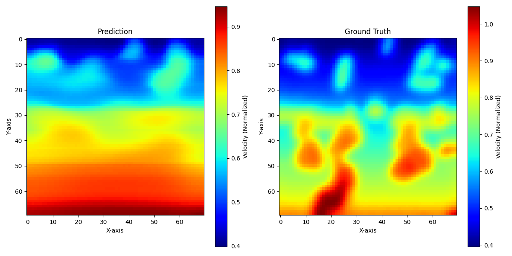</td> 
  </tr> 
  <tr> 
    <td>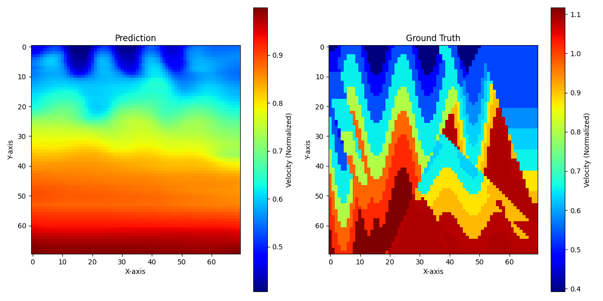</td> 
    <td>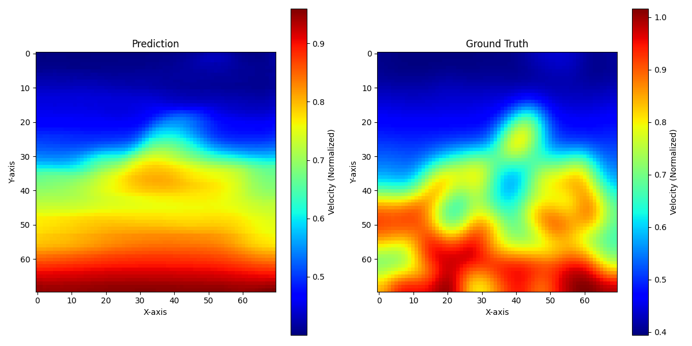</td> 
  </tr> 
  <tr> 
    <td>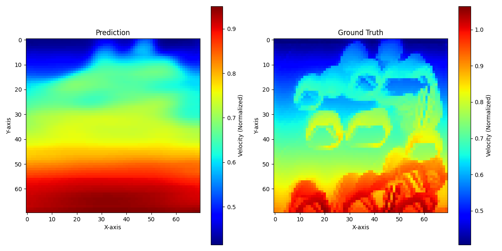</td> 
    <td>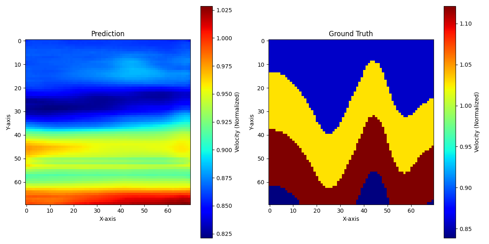</td> 
  </tr> 
</table>

**🧠 Analysis: Physics Loss — Right Direction, Insufficient Signal**
* The Hybrid CNN-Swin architecture delivered marginal improvements over V3: MAE dropped 5.3% and RMSE dropped 6.1%. The CNN encoder/decoder successfully reduced the extreme over-smoothing seen in V3's pure transformer upsampling.
* The physics loss (`physics_loss()` via Deepwave) was successfully integrated and verified — Deepwave forward modeling runs on GPU and produces valid gradients.
* However, the physics loss contribution was **mathematically negligible**: `physics_loss ≈ 0.003` vs `total_loss ≈ 12.0`. Even at maximum weight (0.5), it contributed < 1% of the total gradient. The amplitude normalization step (dividing both synthetic and observed seismic by their respective max values) compressed the loss to near-zero.
* The SSIM ceiling persists at `0.85` — a slight improvement over V3's `0.84`, but the fundamental "1D safe zone" mode collapse pattern remains visible in the predictions.
* Training was interrupted 3 times by Modal worker preemptions. Only 89 of the planned 400 epochs completed. Checkpoint frequency was increased from 50 → 10 epochs after the first data loss incident.

**🔑 Key Takeaways**
* The Hybrid CNN-Swin architecture is a genuine improvement over pure Swin-UNet — CNN inductive bias produces less blurry predictions.
* Physics-informed loss via Deepwave is technically feasible (runs on GPU, differentiable, correct shapes) but the current implementation's normalization scheme makes it too weak to break the SSIM ceiling.
* The `0.84-0.85` SSIM ceiling appears to be a fundamental limit of the current loss formulation, not the architecture. The model needs a physics loss that's 50-100x stronger to provide meaningful gradient signal.

**📂 Artifacts**
* Weights: `results/v4/uNet_v4.pth`
* Checkpoint: `results/v4/checkpoint_epoch_80.pth`
* Validation PNGs: `results/v4/pred_vs_GT_*.png`
* Evaluation Summary: `results/v4/eval_summary.txt`

**➡️ Future Directions**
* Redesign physics loss to compare **travel-time shifts** or **envelope mismatches** instead of amplitude-normalized MSE — these are more sensitive to velocity errors.
* Increase physics loss magnitude by removing per-sample normalization and using a fixed global scaling.
* Consider **multi-scale physics loss** — compare at multiple frequency bands to capture both macro structure and fine detail.
* Explore **encoder-only physics** — apply the wave equation constraint directly to intermediate feature maps rather than the final output.

---

### 🟢 Version 5: Deep CNN Encoder-Decoder (InversionNet-Style)
* **Status**: Completed (400 Epochs — full run)
* **Environment**: Modal A100-80GB
* **Architecture**: Deep CNN Encoder-Decoder with ~27.6M parameters
  * **Encoder**: 5-stage conv blocks with asymmetric striding (preserves spatial grid while compressing time dimension)
  * **Bottleneck**: 2 deep residual blocks at (512, 8, 9) — ~37k spatial values (vs ~15k in V3/V4)
  * **Decoder**: 3-stage upsampling with interpolation + residual refinement
  * **Head**: Conv refinement block + linear output projection
* **Data Configuration**:
  * **Dataset**: OpenFWI — 20 files (10,000 samples total)
  * **Split Strategy**: Sample-level (randomly mixed)
    * Train: 8,000 samples (80%)
    * Val: 1,000 samples (10%)
    * Test: 1,500 samples (15%)

**🔁 Key Changes from v4**
* **Completely removed Swin Transformer** — replaced with pure CNN encoder-decoder (InversionNet-inspired).
* **Removed Deepwave / physics loss** — physics loss was contributing <1% of gradient signal in V4; training is now purely data-driven.
* **Wider bottleneck**: ~37k spatial values vs V4's ~15k. Prevents aggressive information compression that caused mode collapse.
* **Removed `einops` and `deepwave` dependencies** — streamlined pipeline.
* **Increased capacity**: 27.6M params (vs V4's 17.1M) for deeper feature representation.

**⚙️ Training Configuration**
* **Optimizer**: AdamW (`lr=0.0005`, `weight_decay=0.01`)
* **Scheduler**: Linear Warmup (50 epochs) → Cosine Annealing (350 epochs)
* **Batch Size**: 16
* **Epochs**: 400 (full run)
* **Loss Function**: `100 * (1.0 * L1 + 0.1 * MSE + 0.2 * Gradient + 0.3 * SSIM + 0.01 * TV)`

**📊 Evaluation Results (Test Set - 1500 Samples)**
* Final Train Loss: `~10.2`
* Final Val Loss: `~13.0`
* Test MAE: `167.83` m/s
* Test RMSE: `255.28`
* Test SSIM: `0.8201`
* Test Edge Error: `0.0229`

**📈 V4 → V5 Improvement**

| Metric | V4 | V5 | Change |
| :--- | :--- | :--- | :--- |
| Test MAE | 251.18 m/s | 167.83 m/s | **↓ 33.2%** |
| Test RMSE | 343.47 | 255.28 | **↓ 25.7%** |
| Test SSIM | 0.8500 | 0.8201 | ↓ 3.5% |
| Edge Error | 0.0227 | 0.0229 | ≈ same |
| Parameters | 17.1M | 27.6M | +61% |

**🖼️ Sample Predictions**
<table> 
  <tr> 
    <td>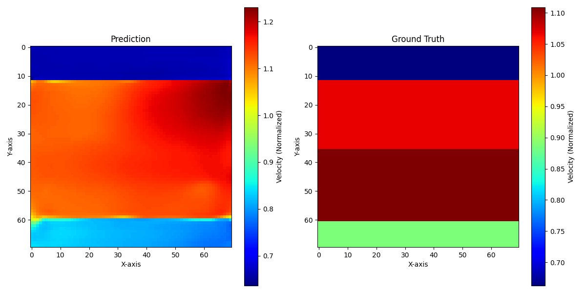</td> 
    <td>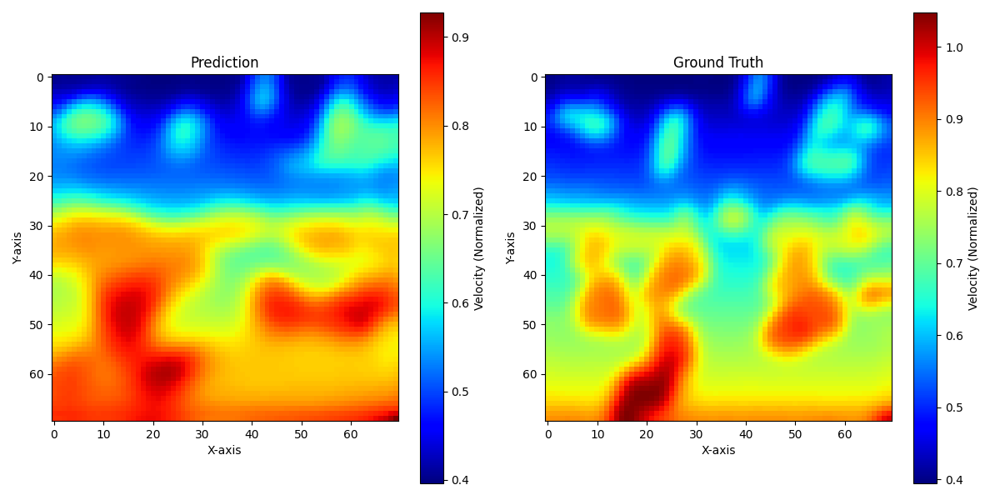</td> 
  </tr> 
  <tr> 
    <td>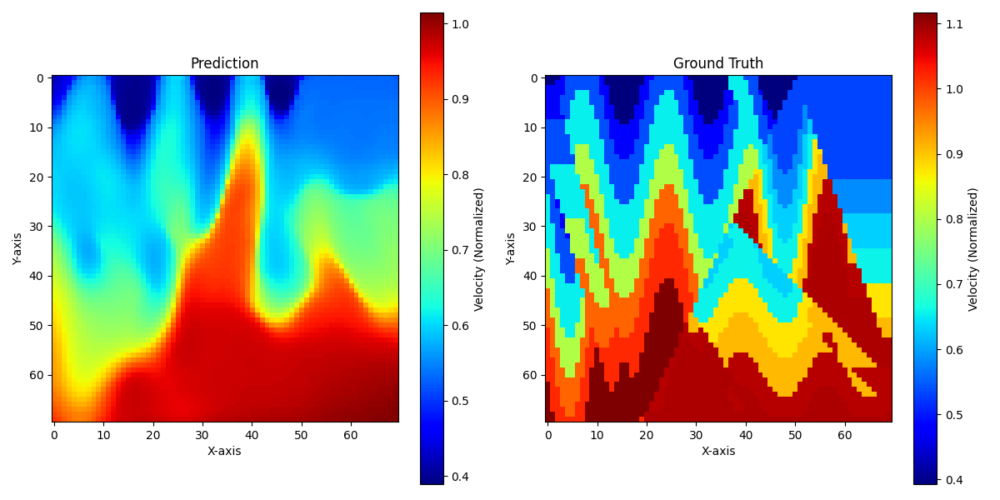</td> 
    <td>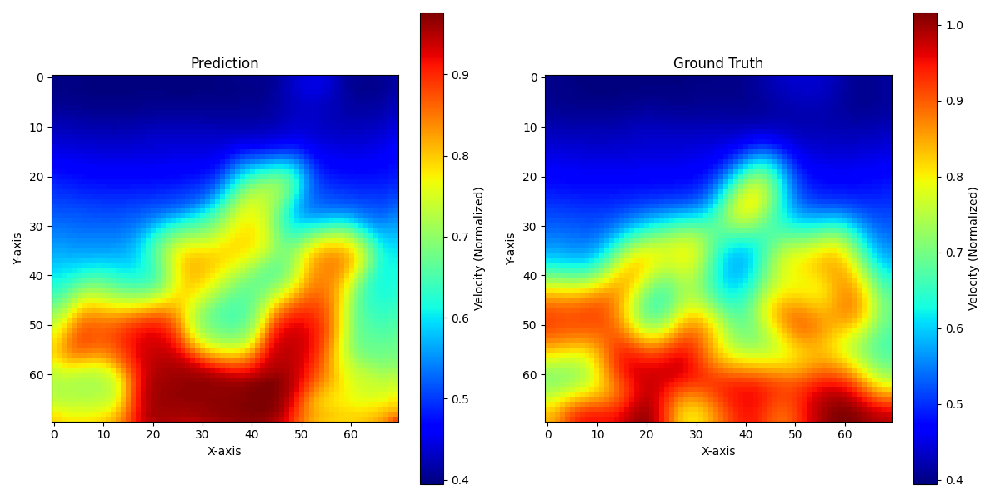</td> 
  </tr> 
  <tr> 
    <td>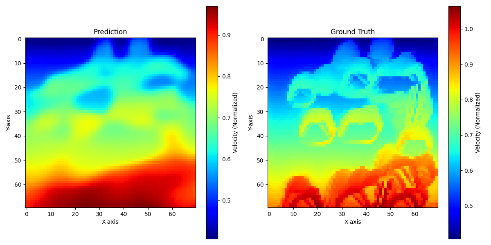</td> 
    <td>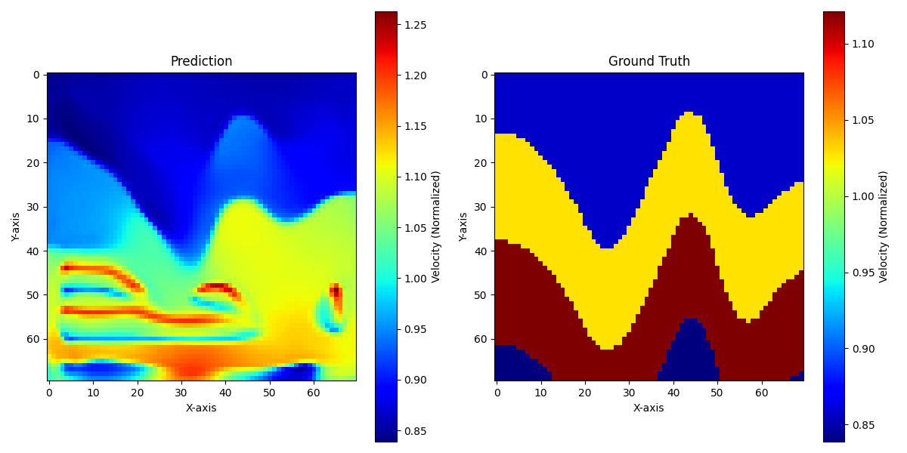</td> 
  </tr> 
</table>

**🧠 Analysis: The SSIM Paradox — Better Model, Lower SSIM**
* V5 achieved the **largest single-version MAE improvement in project history** (33.2% reduction). The model is predicting velocity values significantly closer to ground truth than any previous version.
* However, SSIM *decreased* from 0.85 to 0.82. This is not a regression — it's a fundamental change in model behavior:
  * **V3/V4 Strategy**: Predict a safe, smooth 1D depth gradient for every input. This is structurally "close" to most geological models (since velocity generally increases with depth), yielding high SSIM but very wrong actual velocities.
  * **V5 Strategy**: Actually attempt to resolve lateral features (faults, velocity contrasts, folded layers). When these features are slightly mislocated (by 2-3 pixels), SSIM penalizes heavily even though the model is genuinely understanding the geology.
* The validation loss curve shows **moderate overfitting** after epoch 250 (train ~10 vs val ~13), indicating the model has some remaining capacity to improve with regularization or data augmentation.
* The SSIM curve stabilized at ~0.82 by epoch 300 and did not degrade further, suggesting this is a legitimate performance level rather than training instability.

**🔑 Key Takeaways**
* **Pure CNN > Transformers** for seismic-to-velocity inversion at this data scale. The CNN's local inductive bias is better suited to wavefield structure than Swin's global attention.
* **Wide bottleneck is critical**: Preserving ~37k spatial values (vs V3/V4's ~15k) allowed the model to break free from mode collapse and actually attempt lateral feature resolution.
* **SSIM is a misleading metric** for this task when comparing models with fundamentally different strategies. MAE and RMSE are more reliable indicators of actual prediction quality.
* **Removing physics loss had no negative impact** — confirming V4's finding that the Deepwave physics contribution was negligible due to normalization.

**📂 Artifacts**
* Best Weights: `results/v5/uNet_v5.pth`
* Final State (with all metrics): `results/v5/final_training_state.pth`
* Training Curves: `results/v5/loss_vs_epochs.png`, `results/v5/val_ssims_vs_epochs.png`, `results/v5/lrs_vs_epochs.png`
* Validation PNGs: `results/v5/pred_vs_GT_*.png`
* Evaluation Summary: `results/v5/eval_summary.txt`

**➡️ Future Directions**
* **Add skip connections** (encoder→decoder) to recover fine spatial detail lost in the current architecture — this is likely the single biggest improvement available.
* **Multi-scale loss**: Compute loss at multiple resolutions to balance macro-structure and fine-detail learning.
* **Data augmentation**: Random flips, rotations, and noise injection to reduce the train-val gap.
* **Continue training**: Loss was still declining at epoch 400 — additional epochs with lower LR could yield incremental gains.
