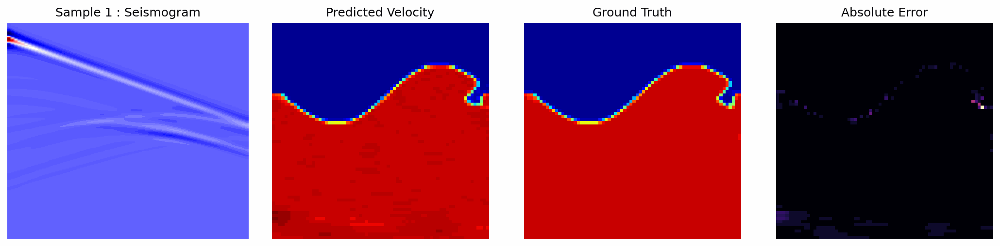
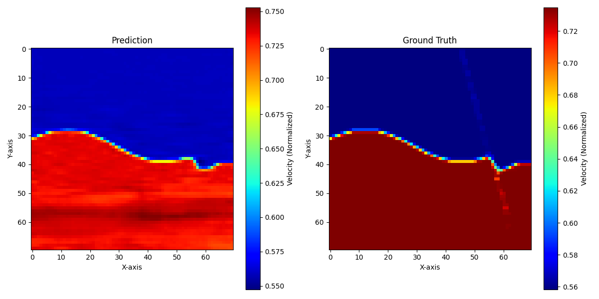
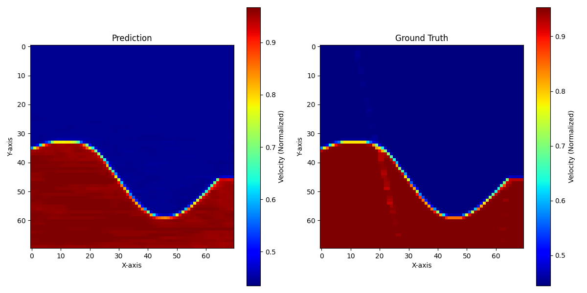
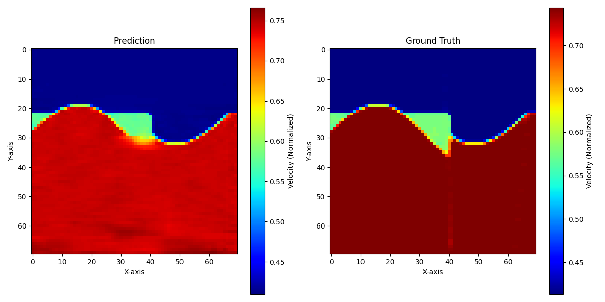
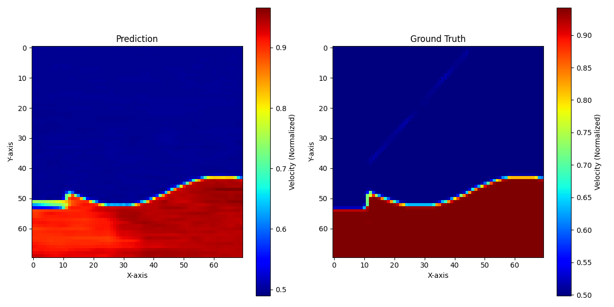
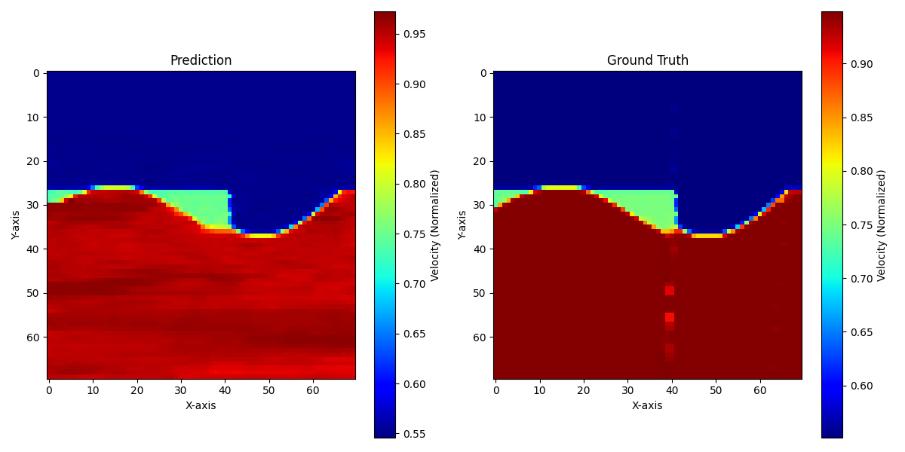
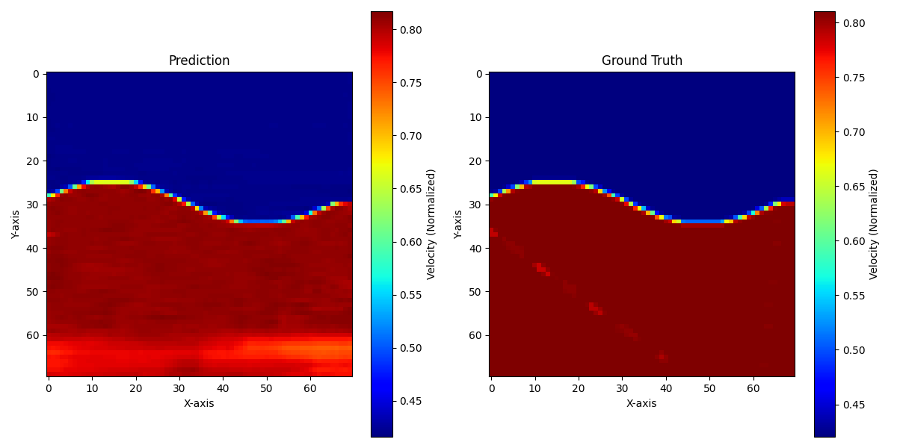

# GeoNet-Inversion

Turning seismic wave signals into detailed underground maps with deep neural networks.



## Project Structure

- `config.py`: Centralized hyperparameters and paths.
- `dataset.py`: Data loading and normalization.
- `model.py`: UNet architecture and loss functions (SSIM, Gradient).
- `utils.py`: Plotting and physical metric calculations (MAE, RMSE, Edge Error).
- `train.py`: Training pipeline .
- `evaluate.py`: Evaluation and visualization .

## Usage

### Training
To train the model:
```bash
python train.py
```

### Evaluation
To evaluate the trained model:
```bash
python evaluate.py
```

## 📊 Training Logs & Version History

| Version | Architecture | Params | Key Features / Changes | Final Loss | SSIM |
| :--- | :--- | :--- | :--- | :--- | :--- |
| **v1** | Baseline U-Net | ~467k | Initial proof-of-concept, single file | 5.835 | N/A |
| **v2** | Scaled U-Net | ~1.93M | Increased channel counts, Cosine Decay with LR Scheduling | 0.8082 | Yes |

---

### 🟢 Version 1: Baseline U-Net
* **Status**: Completed
* **Environment**: Google Colab (T4 GPU)
* **Architecture**: Standard U-Net with skip connections (~467,105 parameters)
* **Data Configuration**: 
  * Inputs: 5 sources, 1000 time samples, 70 receivers.
  * Targets: 70x70 single-channel velocity maps.
  * Scope: Single `.npy` file proof-of-concept.

**⚙️ Training Parameters**
* **Optimizer**: Adam (`lr=0.001`)
* **Batch Size**: 1
* **Epochs**: 200
* **Loss Function**: `100 * (MAE + 0.1 * MSE + 0.5 * Gradient Loss)`

**📈 Results & Observations**
* **Quantitative**: Final Training Loss: `5.8353`.
* **Qualitative**: Achieved high-fidelity recovery of the macro-velocity structures. The model perfectly located the boundary between the two layers and identified the correct global velocity trends. Minor horizontal striation artifacts and slight edge blurring were present.
* **Key Takeaway**: The baseline proves the effectiveness of structural losses (gradient loss) in geophysical inversion tasks.

**📂 Artifacts**
* Weights: `results/v1/uNet_v1.pth`
* Visualization: `results/v1/pred_vs_GT_v1.png`
* Metrics Plot: `results/v1/epochs_vs_loss_v1.png`

**➡️ Next Steps for v2**: Scale up model capacity (double channel counts), implement SSIM loss to reduce horizontal artifacts, and add LR schedule with cosine decay.

---

### 🟢 Version 2: Scaled U-Net
* **Status**: Completed
* **Environment**: Google Colab (T4 GPU)
* **Architecture**: Scaled U-Net with skip connections (~1.9M parameters)
* **Data Configuration**: 
  * Inputs: 5 sources, 1000 time samples, 70 receivers.
  * Targets: 70x70 single-channel velocity maps.
  * Scope: Single `.npy` file.

**🔁 Key Changes from v1**
* Increased channel capacity (16→32→64→128→256)
* Added SSIM loss
* Switched to AdamW
* Added Cosine LR decay
* Increased epochs (200 → 400)
* Increased batch size (1 → 2)

**⚙️ Training Configuration**
* **Optimizer**: AdamW (`lr=0.001`)
* **Scheduler**: Cosine Decay
* **Batch Size**: 2
* **Epochs**: 400
* **Loss Function**: `100 * (MAE + 0.1 * MSE + 0.2 * Gradient + 0.3 * SSIM)`

**📊 Quantitative Results**
* Final Loss: `0.8082`
* MAE: `18.26` m/s
* RMSE: `43.75`
* SSIM: `0.9910`
* Edge Error: `0.0042`

**🧠 Qualitative Analysis**
* Near-perfect reconstruction of subsurface structure with highly accurate boundary localization.
* Significant reduction in artifacts compared to v1.
* Minor issues include slight boundary thickness and low-frequency banding.

**🖼️ Sample Predictions**
<table> 
  <tr> 
    <td></td> 
    <td></td> 
  </tr> 
  <tr> 
    <td></td> 
    <td></td> 
  </tr> 
  <tr> 
    <td></td> 
    <td></td> 
  </tr> 
</table>

**📈 Training Behavior**
* Smooth convergence with no instability.
* Late-stage improvement due to cosine decay.
* No underfitting observed.

**🔑 Key Takeaways**
* Model scaling significantly improved reconstruction quality.
* SSIM loss is critical for structural alignment.
* LR scheduling improves convergence and final performance.
* Model captures both global and local geological features reliably.

**📂 Artifacts**
* Weights: `results/v2/uNet_v2.pth`
* Metrics Plot: `results/v2/epochs_vs_loss_v2.png`
* LR Schedule: `results/v2/lr_vs_epochs_v2.png`

**➡️ Next Steps for v3**
* Add Total Variation (TV) loss for smoother regions.
* Increase Gradient Weight (0.2 --> 0.3)
* Improve boundary sharpness.
* Evaluate on multiple files to test generalization.
* Introduce a validation split.

